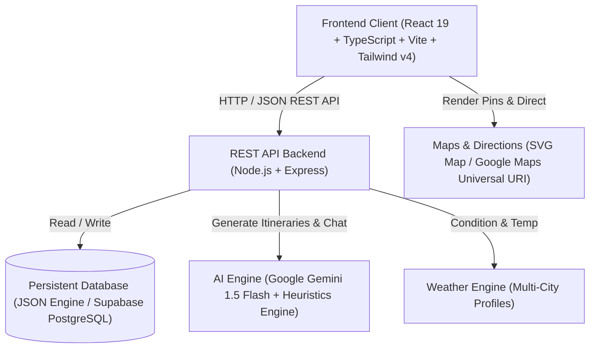

# System Architecture — Travel With You 🚀

## Overview
**Travel With You** is an AI-powered student travel discovery and companion web application built with a modern multi-tier decoupled architecture:



---

## Folder Organization

```text
travel-with-you/
├── .vscode/                      # IDE workspace configuration
│   ├── launch.json               # 1-click debug launcher for server & client
│   └── settings.json             # Code formatting and TypeScript settings
├── docs/                         # Technical & architecture documentation
│   ├── API_DOCUMENTATION.md      # Full REST API endpoints specification
│   └── ARCHITECTURE.md           # System design & entity models
├── frontend/                     # Client Application
│   ├── public/                   # Static assets & SVG icons
│   ├── src/
│   │   ├── assets/               # Branding graphics
│   │   ├── components/           # Reusable UI widgets
│   │   │   ├── auth/             # Login & Signup modals
│   │   │   ├── CitySelectorModal.tsx   # Campus district switcher
│   │   │   ├── FloatingAIAssistant.tsx # Persistent floating AI chat
│   │   │   ├── HackathonDemoBanner.tsx # 3-minute hackathon flow bar
│   │   │   ├── PlaceCard.tsx     # Rich place cards with student badges
│   │   │   ├── PlaceDetailModal.tsx    # Safety notes & student reviews
│   │   │   └── SurpriseMeModal.tsx     # Serendipity activity generator
│   │   ├── pages/                # 8 Main application pages
│   │   │   ├── LandingPage.tsx   # 13 Homepage sections
│   │   │   ├── ExplorePage.tsx   # Smart filters & List/Map toggle
│   │   │   ├── MapPage.tsx       # Live interactive hotspot map
│   │   │   ├── PlannerPage.tsx   # Student Mode & AI Day Planner
│   │   │   ├── BudgetPage.tsx    # Expense tracker & group bill splitter
│   │   │   ├── SavedPage.tsx     # Wishlist collection & stats
│   │   │   ├── MemoriesPage.tsx  # Photo journal & college diary
│   │   │   └── ProfilePage.tsx   # Student profile & preferred vibes
│   │   ├── types/                # Core TypeScript definitions
│   │   └── utils/                # API client, Gemini AI, constants
│   ├── package.json              # Frontend dependencies & scripts
│   ├── tsconfig.json             # TypeScript configuration
│   └── vite.config.ts            # Fast Vite bundler configuration
├── server/                       # Backend Application
│   ├── data/                     # Data stores
│   │   ├── database.json         # Atomic persistent JSON database
│   │   └── places.js             # Curated student hotspots catalog
│   ├── db.js                     # Atomic database driver
│   ├── index.js                  # Express server & REST API routes
│   ├── test-endpoints.js         # Automated API validation suite
│   └── package.json              # Server dependencies & scripts
├── supabase/                     # Cloud Database Migration
│   └── migrations/
│       └── 001_initial_schema.sql # Production PostgreSQL schema
├── .env.example                  # Environment configuration template
├── .gitignore                    # Git ignore rules
├── dev.js                        # Cross-platform concurrent dev runner
├── package.json                  # Workspace orchestration root
└── README.md                     # Comprehensive project documentation
```

---

## Data Models

### 1. Place
```typescript
interface Place {
  id: string;
  name: string;
  category: 'cafes' | 'study_spots' | 'street_food' | 'theatres' | 'parks_nature' |
            'restaurants' | 'entertainment' | 'viewpoints' | 'cultural_temples' |
            'shopping' | 'photo_spots' | 'weekend_trips';
  description: string;
  address: string;
  area: string;
  city: string;
  latitude: number;
  longitude: number;
  priceLevel: number; // 0=Free, 1=<₹150, 2=₹150-350, 3=₹350-700, 4=₹700+
  approxCostForOne: number;
  rating: number;
  reviewCount: number;
  openingTime: string;
  closingTime: string;
  imageUrl: string;
  hasWifi: boolean;
  hasCharging: boolean;
  isQuiet: boolean;
  isOutdoor: boolean;
  isStudentFriendly: boolean;
  studentPerks: string[];
  distanceKm?: number;
  safetyNotes?: string;
}
```

### 2. Student Review
```typescript
interface Review {
  id: string;
  placeId: string;
  userId: string;
  userName: string;
  rating: number;             // 1 to 5
  cleanliness: number;        // 1 to 5
  valueForMoney: number;      // 1 to 5
  studentFriendliness: number;// 1 to 5
  comment: string;
  createdAt: string;
}
```

### 3. Student Trip Itinerary
```typescript
interface TripPlan {
  title: string;
  city: string;
  duration: string;
  headcount: number;
  totalBudget: number;
  estimatedCostPerPerson: number;
  estimatedCostForGroup: number;
  budgetGuardianAlert: string;
  budgetBreakdown: {
    food: number;
    transit: number;
    activities: number;
    buffer: number;
  };
  stops: Array<{
    order: number;
    time: string;
    name: string;
    category: string;
    area: string;
    estimatedCostPerPerson: number;
    totalCostForGroup: number;
    description: string;
    tips: string;
  }>;
  transitAdvice: string;
  thingsToCarry: string[];
}
```
